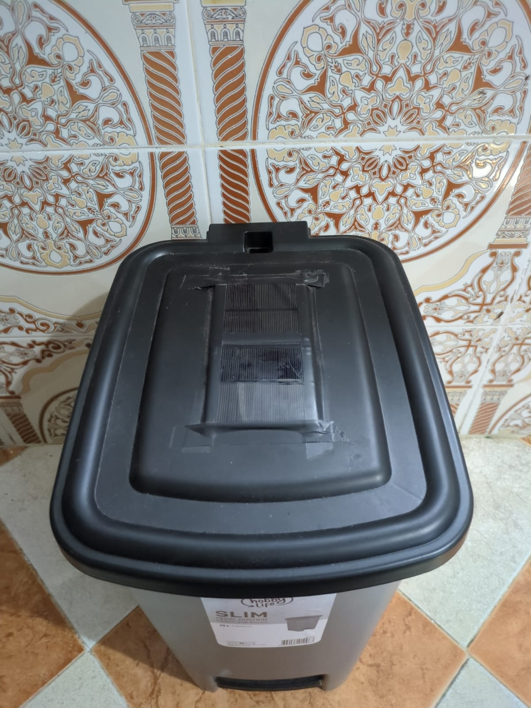
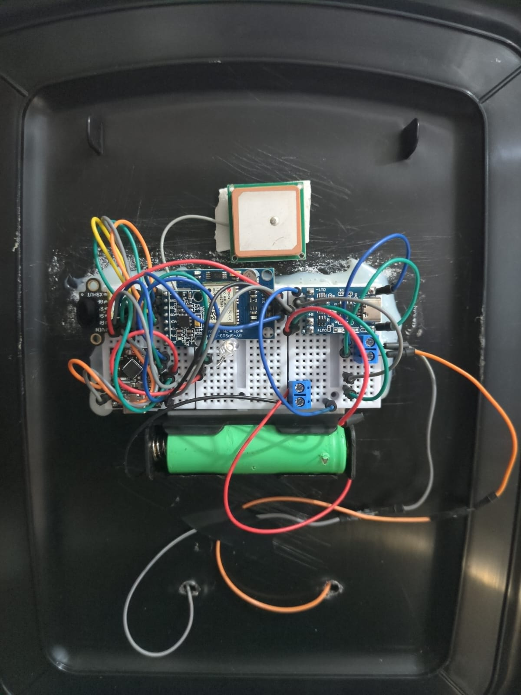

# 🚮 SmartTrash – IoT Waste Management System

SmartTrash is an IoT-based intelligent waste management prototype designed to support smart city infrastructure by enabling real-time monitoring of waste bin conditions.

The system monitors **solar-powered trash bins** in real time, tracking fill level status, door security state, and geographic location using multiple integrated sensors.

---

## 📸 Prototype Images

### Hardware Prototype

|  |  |  |
|---------------------------|---------------------------|---------------------------|

---

## 🌐 Web Dashboard

SmartTrash includes a responsive web monitoring dashboard that provides real-time visualization of bin status.

### Dashboard Features

- Real-time bin location tracking using interactive maps  
  (Supports Google Maps and OpenStreetMap layers)

- Color-coded fill level indicators:
  - 🟢 Green — Safe level  
  - 🟡 Yellow — Moderate level  
  - 🔴 Red — Near capacity warning  

- Notification panel for maintenance alerts

- Statistical graphs for waste collection analysis

### Light Mode Interface

 

### Dark Mode Interface

 

---

## 📱 Mobile Application Interface

The SmartTrash mobile application enables remote monitoring for administrators and operators.

The application is designed to be lightweight, responsive, and suitable for field deployment.

### Mobile Features

- Real-time waste bin fill level monitoring  
- Alert notification system  
- Multi-bin supervision dashboard  
- Optimized user interface for small screens  

|  |  |  |
|-----------------------|-----------------------|-----------------------|
|  |  |  |

---

## ⚙️ System Overview

SmartTrash integrates multiple sensing technologies to provide reliable environmental monitoring.

### Sensor Components

- 📏 Laser Distance Sensor — Measures internal trash fill level  
- 📊 Gyroscope / Accelerometer Sensor — Detects bin orientation, motion, and door state behavior analysis  
- 📡 GPS Module — Provides real-time bin localization  
- ☀️ Solar Power System — Supports autonomous operation  

Sensor data is transmitted to the backend server and visualized in real time through the monitoring dashboard.

---

## 📊 Core Features

- Real-time waste bin monitoring  
- Intelligent alert system for near-full bins  
- Interactive geographic visualization  
- Route optimization potential for waste collection  
- Responsive dashboard with dark and light themes  
- Mobile monitoring support  

---

## 🌍 Environmental Impact

SmartTrash contributes to sustainable urban development by:

- Reducing unnecessary waste collection routes  
- Improving fuel efficiency in municipal operations  
- Supporting smart city infrastructure  
- Promoting environmentally friendly waste management
