# SmartTrash 🚮♻️

SmartTrash is an IoT-powered waste management solution designed to make cities cleaner and smarter.  
It monitors **solar-powered trash bins** in real time, tracking **fill levels**, **bin door status**, and **location** using multiple sensors and a web dashboard.

---

## 📸 Prototype Images

### Hardware Prototype
- Forward view of the SmartTrash prototype  
  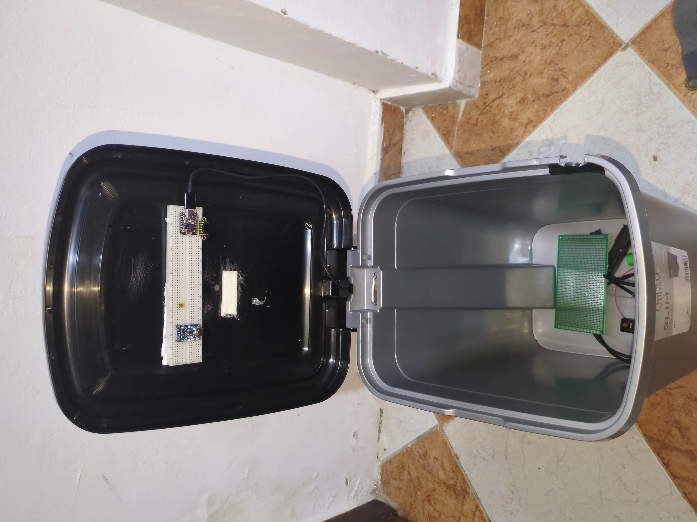

- Top view of the SmartTrash prototype  
  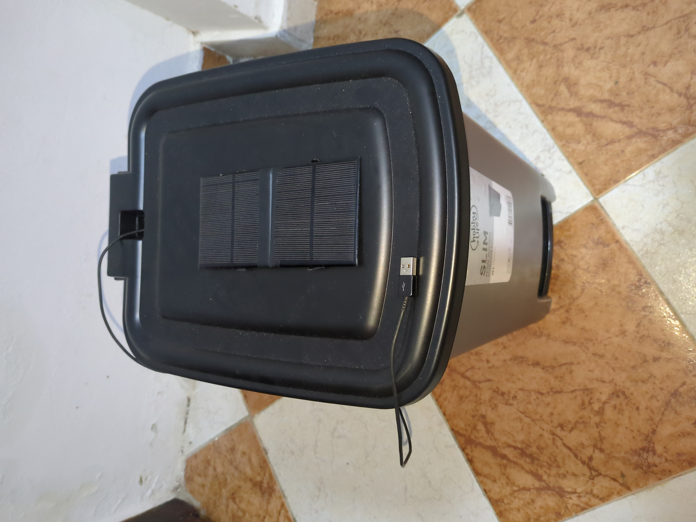

---

## 🌐 Web Dashboard

SmartTrash comes with a responsive web UI that displays:
- **Real-time bin locations** on an interactive map (Google Maps / OpenStreetMap).
- **Fill levels** using color-coded markers (Green = Safe, Yellow = Moderate, Red = Warning).
- **Alerts panel** for instant notifications when bins are nearly full.
- **Bin statistics graphs** for quick analysis.

### Light Mode  
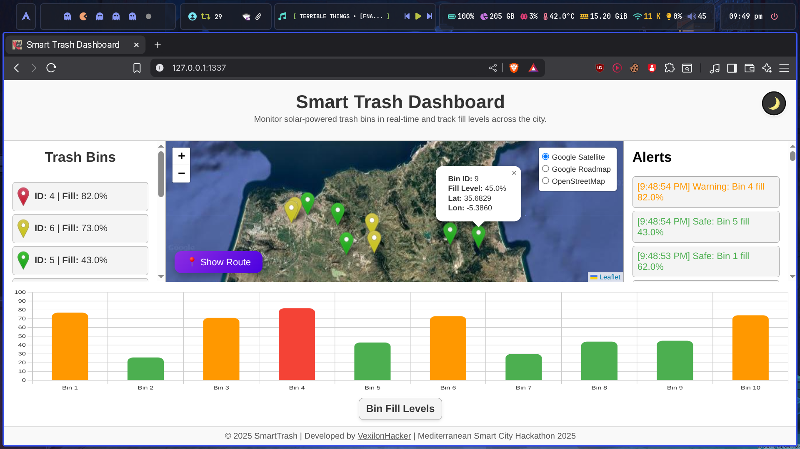
 
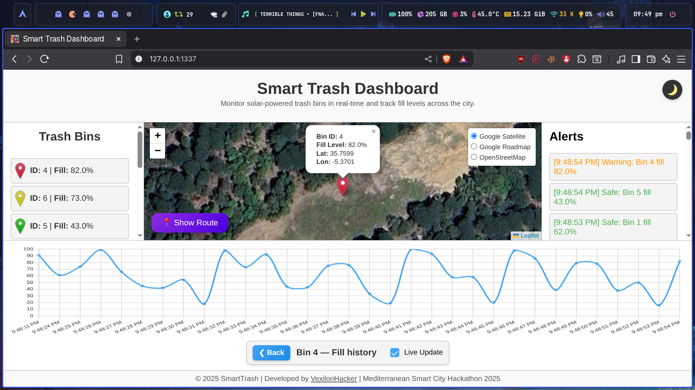
### Dark Mode  
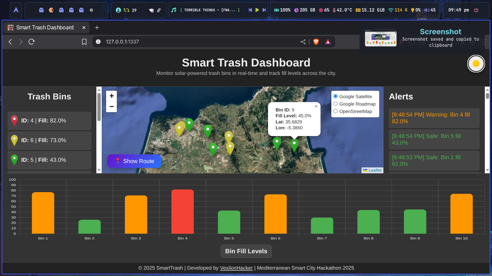
 
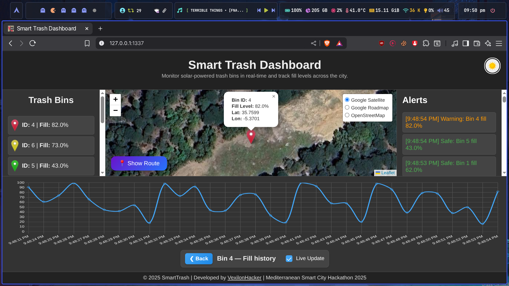

---
## 📱 Mobile App UI

The SmartTrash **Android app** complements the web dashboard, allowing users and administrators to monitor bins on the go.

| 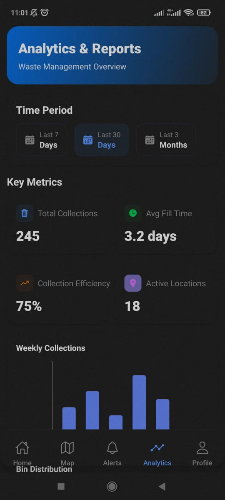 | 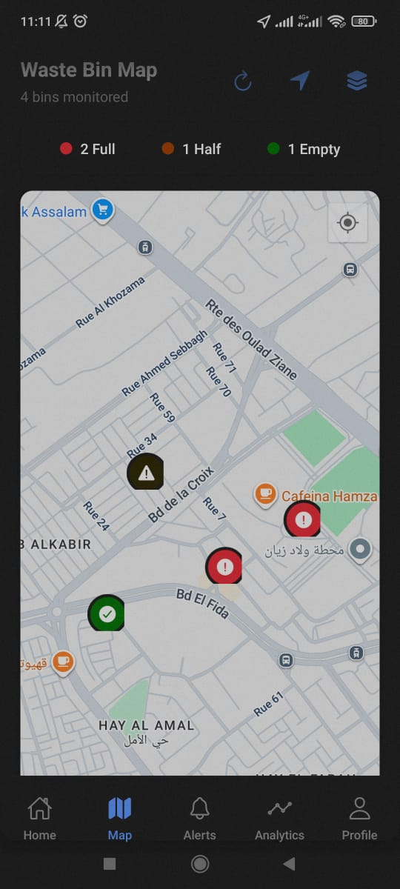 | 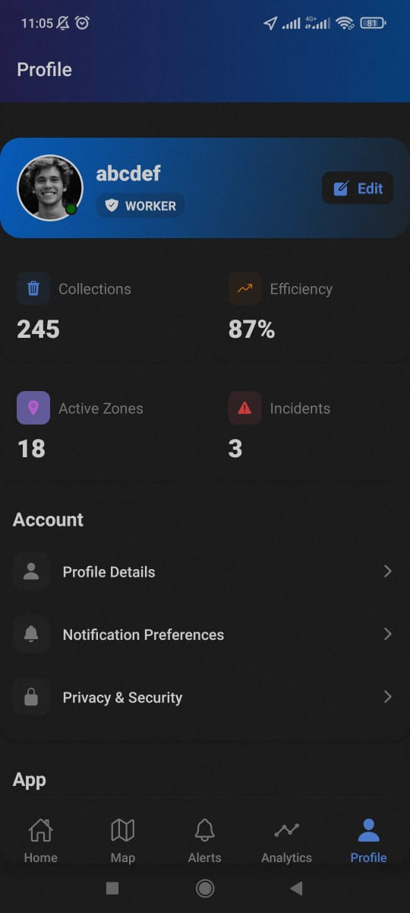 |
|------------------------|------------------------|------------------------|
| 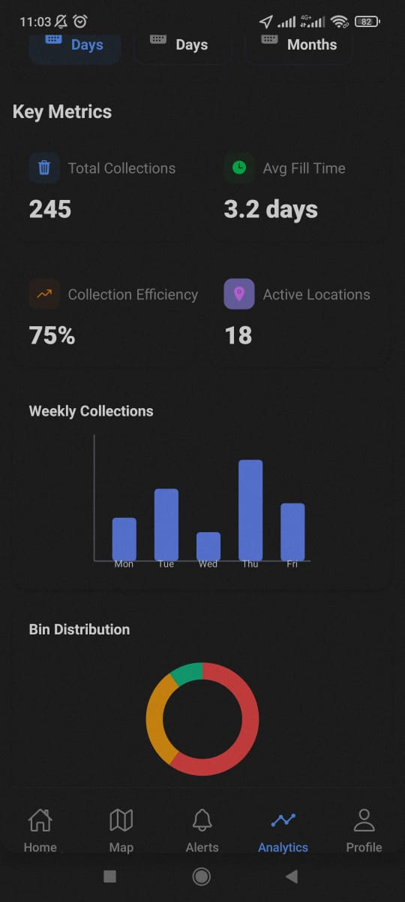 | 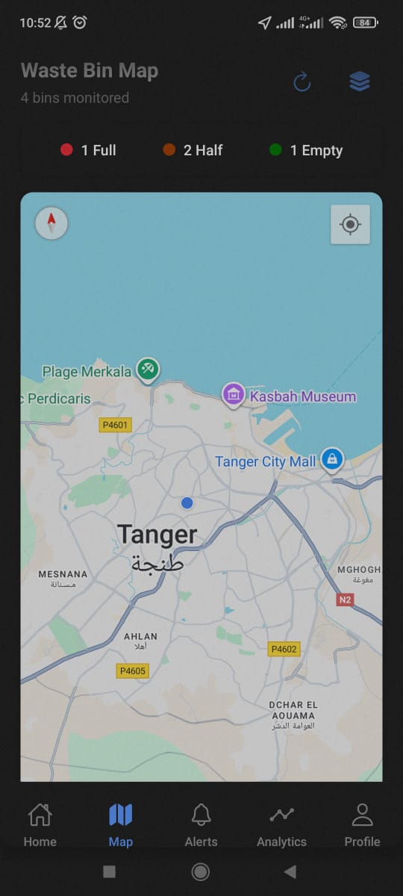 | 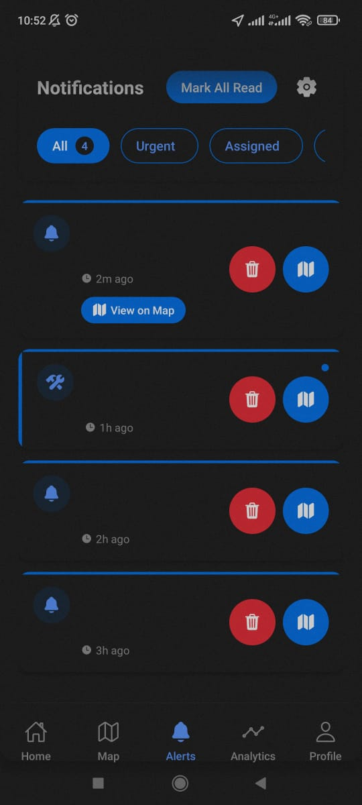 |

---

## ⚙️ System Overview

SmartTrash integrates multiple sensors to deliver reliable data:

- **Laser Sensor** 📏 → Measures the trash fill level inside the bin.
- **Hall Effect Sensor** 🧲 → Detects door/lid openings for security and maintenance monitoring.
- **GPS Module** 📡 → Sends real-time bin location for efficient route planning.
- **Solar Power** ☀️ → Ensures sustainable and independent operation.

Data is collected and visualized in real time via the **Smart Trash Dashboard**.

---

## 📊 Features
- Real-time monitoring of bin fill levels.
- Smart alerts when bins approach capacity.
- Interactive map with bin status.
- Route optimization for collection.
- Clean, responsive dashboard with **dark & light modes**.
- Mobile app for monitoring on the go.

---

## 🌍 Use Case
- Smart cities looking to optimize waste collection.
- Reducing fuel and manpower costs by improving collection routes.
- Encouraging sustainable and efficient waste management.

---

